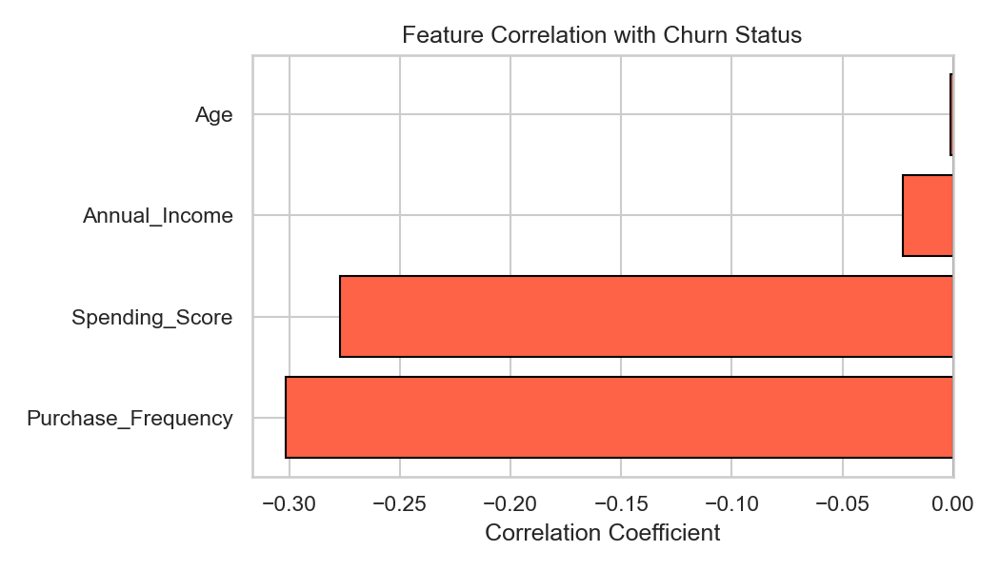
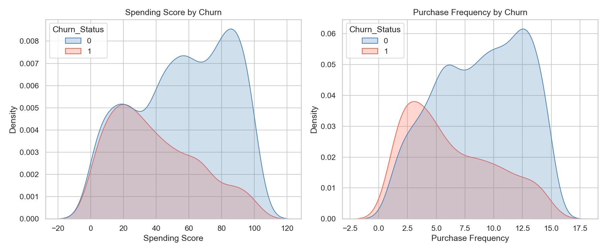
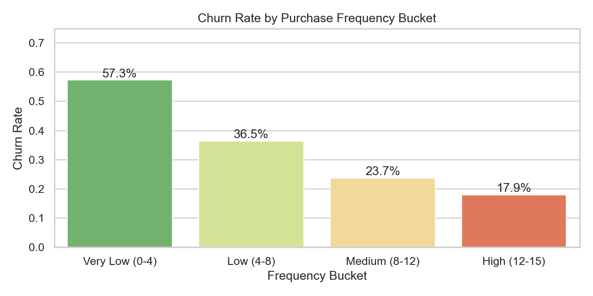
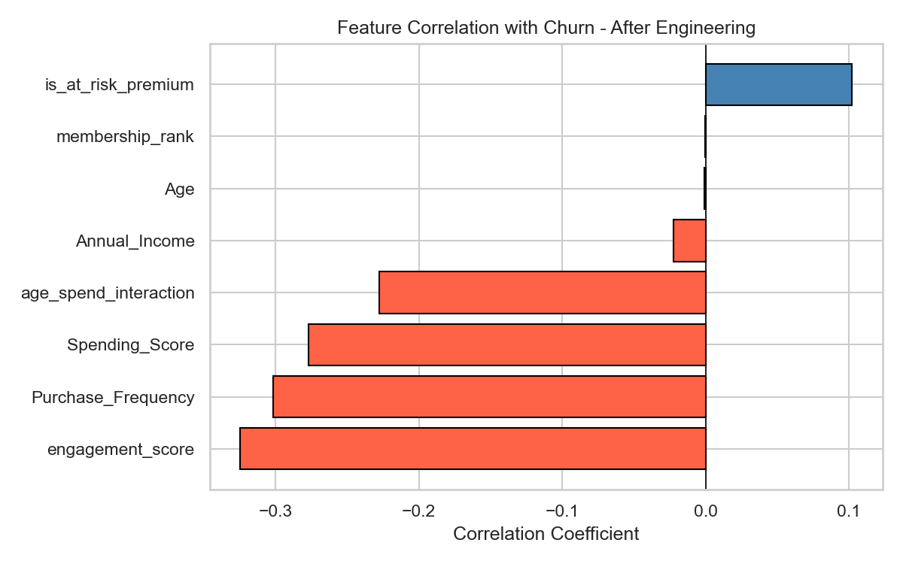
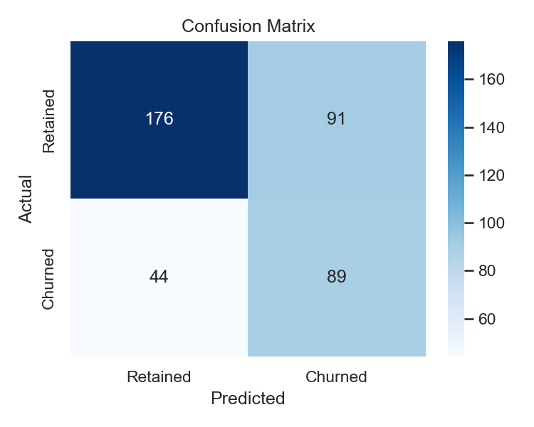
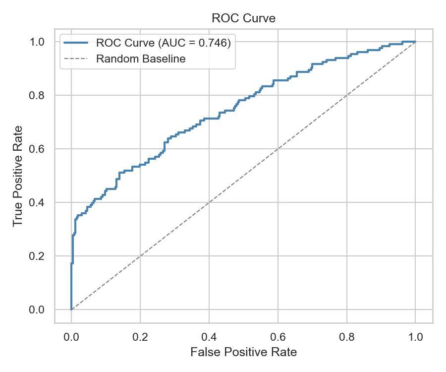
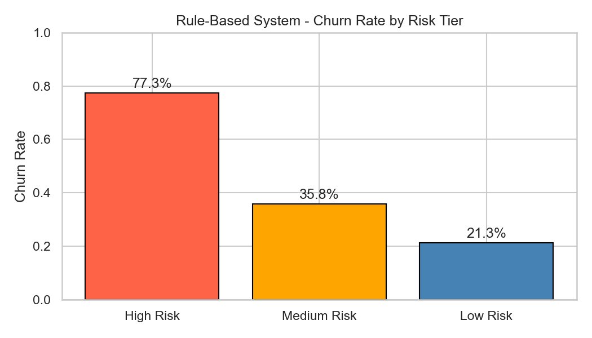
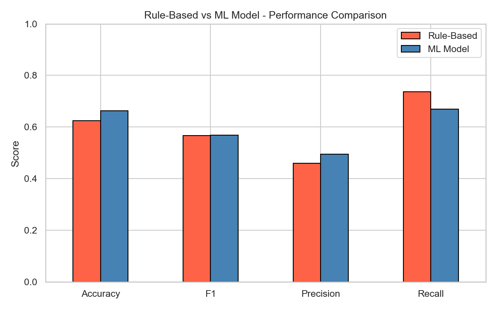

# Customer Churn Prediction

## Business Context

Customer churn is not a data problem — it is a revenue problem.

Research consistently shows that acquiring a new customer costs 5–7x more
than retaining an existing one. For any subscription or membership-driven
business, even a 5% reduction in churn can translate to a 25–95% increase
in profitability.

This project builds a churn prediction system that identifies at-risk
customers **before** they leave — giving the business a window to intervene.

---

## Problem Statement

Given customer demographic and behavioral data, predict the likelihood of
churn for each customer and identify the key drivers behind that decision.

This is a **binary classification problem**:
- `0` → Customer retained
- `1` → Customer churned
---


## Setup

```bash
pip install -r requirements.txt
```

Open `churn_prediction.ipynb` and run all cells top to bottom.

---

## Dataset

- **Source:** Kaggle - Customer Churn Dataset
- **Size:** 2,000 customers, 9 features
- **Target:** `Churn_Status` (0 = Retained, 1 = Churned)
- **Churn Rate:** 33.25% - enough imbalance to make raw accuracy unreliable as the sole metric

Features used: `Age`, `Annual_Income`, `Spending_Score`, `Purchase_Frequency`, `Membership_Level`, `Gender`

---

## Project Structure

```
root/
├── data/
│   └── customer_data_with_churn.csv
├── notebook/
│   └── churn_prediction.ipynb
├── outputs/
│   └── figures/
├── requirements.txt
└── README.md
```

---

## What I Did & What I Found

### 1. Data Validation

First gate before any modeling. Checked for nulls, duplicates and class distribution.

- Zero missing values, zero duplicate rows
- Churn rate: 33.25% (1,335 retained / 665 churned)
- `CustomerID` and `Name` dropped immediately - identifiers, not signals

---

### 2. Exploratory Data Analysis

Every chart was built to answer a specific business question, not just describe the data.

**Key findings:**

- `Spending_Score` and `Purchase_Frequency` are the only two raw features with meaningful separation between churned and retained customers
- Customers with purchase frequency below 4 churn at **57.3%** - the single strongest raw threshold in the dataset
- `Age` and `Annual_Income` are nearly flat across churned vs retained groups - close to zero predictive value on their own
- Membership level shows almost identical churn rates across all four tiers (31-34%) - the loyalty program offers no measurable retention advantage





---

### 3. Feature Engineering

Four new features created - each grounded in an EDA finding, nothing added arbitrarily.

| Feature | Logic | Why |
|---|---|---|
| `engagement_score` | Spending x Frequency | Churners average 253 vs 481 for retained - strongest separator in the dataset |
| `is_at_risk_premium` | High income + low spending flag | This segment churns at 52% vs 33% baseline |
| `age_spend_interaction` | Age x Spending Score | Age alone has -0.001 correlation with churn, combined with spend it reaches -0.228 |
| `membership_rank` | Ordinal: Basic=1, Silver=2, Gold=3, Platinum=4 | Preserves tier hierarchy instead of treating levels as unordered |

After engineering, `engagement_score` became the strongest feature in the dataset with a correlation of **-0.401** against churn - outperforming every raw feature.



---

### 4. Preprocessing Pipeline

Built using `sklearn Pipeline` and `ColumnTransformer` - no manual transformations scattered across cells.

- Numeric features: `SimpleImputer(median)` → `StandardScaler`
- Categorical features: `SimpleImputer(most_frequent)` → `OneHotEncoder`
- `Membership_Level` ordinally encoded to preserve tier order
- Train/test split: **80/20**, stratified to preserve the 33.25% churn ratio in both sets

```
Train: 1,600 rows - churn rate 33.25%
Test:   400 rows - churn rate 33.25%
```

Stratification confirmed - both splits carry identical churn distribution, ensuring evaluation is not skewed by imbalance.

---

### 5. Model Development

Four models trained through the same pipeline using `StratifiedKFold(n_splits=5)` cross-validation. Class imbalance handled at model level using `class_weight='balanced'` and `scale_pos_weight` - not SMOTE, which would introduce synthetic noise on a 2,000-row dataset.

**Cross-Validation Results:**

| Model | ROC-AUC | F1 | Precision | Recall |
|---|---|---|---|---|
| **Logistic Regression** | **0.7275** | **0.5432** | 0.4977 | **0.5997** |
| Random Forest | 0.7145 | 0.5061 | **0.7570** | 0.3817 |
| XGBoost | 0.7112 | 0.5123 | 0.5684 | 0.4701 |
| LightGBM | 0.7111 | 0.5255 | 0.5592 | 0.4964 |

**Best model: Logistic Regression** - selected on ROC-AUC from cross-validation, test set kept untouched until final evaluation.

The fact that Logistic Regression outperformed XGBoost and LightGBM is not surprising - it directly confirms the EDA finding that the churn signal in this dataset is largely linear, concentrated in two behavioral features. A simpler model captured it better.

---

### 6. Final Evaluation & Business Impact

Best model evaluated on the held-out test set (400 customers, 133 actual churners).

**Test Set Results:**

| Metric | Score |
|---|---|
| ROC-AUC | **0.7458** |
| Recall (churners) | **66.9%** |
| Precision (churners) | 0.49 |
| F1 (churners) | 0.57 |
| Overall Accuracy | 66.25% |

The model caught **89 out of 133 churners** on the test set.

**Business Impact (test set projection):**

```
Churners caught        : 89 (66.9% recall)
Retention campaign success rate assumed : 35%
Customers retained     : 31
Average monthly value  : $60
Revenue protected/year : $22,320
```

Even at a conservative 35% retention success rate, identifying churners before they leave translates to measurable revenue protection. At full dataset scale (665 churners), this projects to **~$111,000/year**.




---

### 7. Rule-Based Churn System

Built a weighted scoring engine as a transparent, explainable alternative to ML. Rules derived directly from EDA thresholds - no guesswork.

**Scoring Logic:**

| Condition | Score |
|---|---|
| Purchase Frequency < 4 | +40 |
| Purchase Frequency 4-8 | +20 |
| Spending Score < 25 | +35 |
| Spending Score 25-50 | +15 |
| At-Risk Premium flag = 1 | +15 |
| Membership = Basic | +10 |

**Risk Tiers:** Score ≥ 60 → High Risk / Score ≥ 30 → Medium Risk / Below → Low Risk

**Validation against actual churn labels:**

| Risk Tier | Customers | Actual Churn Rate |
|---|---|---|
| High Risk | 216 | **77.3%** |
| Medium Risk | 816 | 35.8% |
| Low Risk | 968 | 21.3% |

The High Risk tier's 77.3% actual churn rate confirms the scoring thresholds are well-calibrated.

**Rule-Based vs ML - head to head on test set:**

| Metric | Rule-Based | ML Model |
|---|---|---|
| Accuracy | 0.625 | **0.663** |
| F1 | 0.567 | **0.569** |
| Precision | 0.460 | **0.494** |
| Recall | **0.737** | 0.669 |

Rule-based system achieves higher recall (0.737 vs 0.669) - it casts a wider net and misses fewer churners. ML wins on every other metric because it captures interaction effects between features that fixed thresholds cannot express.

In a production setting these two are not competitors - rules provide explainability for customer-facing decisions, ML drives the automated scoring pipeline.




---

## Key Takeaways

- **Spending Score and Purchase Frequency drive churn** - Age and Income add almost no signal in isolation
- **Feature engineering mattered** - engagement_score (correlation -0.401) outperformed every raw feature including the two it was built from
- **Logistic Regression won** - on a dataset where signal is linear, simpler models generalize better than ensemble methods
- **Rule-based recall (73.7%) beats ML recall (66.9%)** - for a business prioritizing zero missed churners, rules are the safer intervention trigger
- **Membership tier is a broken signal** - all four tiers churn at nearly the same rate, suggesting the loyalty program needs a structural rethink